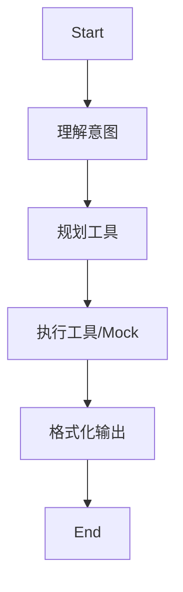

# CTF-ASAS v2.0 Agent 设计文档 (ReAct + Platform Integration)

**创建日期:** 2026-02-10  
**版本:** 2.0  
**状态:** 规划中  
**前置版本:** [v1.0 MVP](./2026-02-07-asas-agent-mvp-design.md)

---

## 1. 核心目标 (What's New?)

CTF-ASAS v1.0 验证了 `Agent -> MCP` 的通信链路，但其核心仍然是一个**固定流程的状态机** (Understand -> Plan -> Execute)，且依赖简单的关键词匹配或 Mock 对话。

**v2.0 的核心目标是架构重构，从“固定流程”进化为“动态推理 (ReAct)”**，并引入**平台闭环**能力。

### 1.1 关键特性

1. **ReAct 架构 (Reason-Act)**: 摒弃 v1.0 的固定 Graph，转而使用 LangGraph 的 ReAct 模式（`prebuilt.create_react_agent` 或自定义循环），允许 Agent 自主决定何时调用工具、调用几次工具。
2. **Claude Tool Use 原生支持**: 移除 v1.0 中脆弱的 Prompt 解析与 Regex 提取，全面对接 Claude 3.5 Sonnet 的 `tools` API（Function Calling）。
3. **平台自动化集成 (Platform Adaptor)**:
    - 实现 `platform_get_challenge`: 一键获取题目信息（描述、附件、动态环境）。
    - 实现 `platform_submit_flag`: 自动提交 Flag 并验证正确性。
4. **动态环境感知**: 若题目启动了 Docker 环境，Agent 能自动感知 `TARGET_IP` 和 `PORT`，无需用户手动输入。

---

## 2. 架构变更 (v1.0 vs v2.0)

### 2.1 v1.0 架构回顾 (固定流水线)



> **痛点**:
>
> 1. 无法处理多步任务（如：先下载附件，再分析，再解密）。
> 2. `Understand` 节点依赖复杂的 Prompt Engineering 来输出结构化 JSON，容易出错。
> 3. 缺乏“观察-思考”的循环，执行失败无法自我修正。

### 2.2 v2.0 架构设计 (ReAct Loop)

```mermaid
graph TD
    Start --> Agent[Agent (LLM + Tools Bindings)]
    Agent -- "调用工具 (tool_calls)" --> Tools[ToolNode (MCP Client)]
    Agent -- "最终回复 (AIMessage)" --> End
    Tools -- "工具输出 (ToolMessage)" --> Agent
```

> **优势**:
>
> 1. **循环推理**: Agent 可以 `思考 -> 调用 recon -> 观察结果 -> 思考 -> 调用 exploit -> 观察结果 -> 提交 flag`。
> 2. **原生准确**: Claude 的 Tool Use API 比 Regex 解析准确率高得多。
> 3. **状态简化**: 状态不再需要复杂的 `planned_tool` / `task_understanding` 字段，直接使用 `messages` 列表（User/AI/Tool Message）。

---

## 3. 详细设计

### 3.1 LangGraph 状态机重构

**State 定义变更:**
v1.0 的 `AgentState` 包含大量自定义字段，v2.0 将简化为标准的 `MessagesState`。

```python
from langgraph.graph import MessagesState

# v2.0 State 仅保留消息历史
class AgentState(MessagesState):
    # 可选：保留少量全局上下文，如当前题目 ID
    platform_url: str | None
    platform_token: str | None
    challenge_id: str | None
```

**Workflow 定义:**

```python
from langgraph.prebuilt import ToolNode
from langgraph.graph import StateGraph, START, END

def create_react_agent(llm, tools):
    # 1. 将 MCP 工具转换为 LangChain Tools 格式
    tool_node = ToolNode(tools)
    
    # 2. 绑定 LLM 与工具
    llm_with_tools = llm.bind_tools(tools)
    
    # 3. 定义 Agent 节点
    def agent_node(state: AgentState):
        result = llm_with_tools.invoke(state["messages"])
        return {"messages": [result]}

    # 4. 构建图
    workflow = StateGraph(AgentState)
    workflow.add_node("agent", agent_node)
    workflow.add_node("tools", tool_node)
    
    workflow.add_edge(START, "agent")
    
    # 5. 条件边: 有 tool_calls 则去 tools，否则结束
    def should_continue(state: AgentState):
        messages = state["messages"]
        last_message = messages[-1]
        if last_message.tool_calls:
            return "tools"
        return END

    workflow.add_conditional_edges("agent", should_continue, ["tools", END])
    workflow.add_edge("tools", "agent")
    
    return workflow.compile()
```

### 3.2 平台适配器 (Platform Adaptor) 设计

新增 `src/asas_mcp/tools/platform.py`，提供标准 CTF 平台（以 CTFd 为蓝本）的交互能力。

**核心工具定义:**

1. **`platform_get_challenge`**:
    - **输入**: `url` (题目 URL)
    - **逻辑**:
        1. 提取 Challenge ID。
        2. 调用 API 获取题目描述。
        3. **自动动作**: 如果有附件，下载到 `/tmp/ctfbot/{id}/`；如果是动态环境，提取 `host:port`。
    - **输出**: 结构化文本 (Markdown)，包含这一步 Agent 需要知道的所有信息（路径、端口、提示）。

2. **`platform_submit_flag`**:
    - **输入**: `flag` (字符串), `challenge_id` (可选，从上下文自动获取)
    - **逻辑**: 调用 `/api/v1/challenges/attempt` 提交。
    - **输出**: `Correct` 或 `Incorrect`。

### 3.3 提示词工程 (System Prompt)

v2.0 的 System Prompt 将更加专注于**角色设定**和**工具使用规范**，而非教 LLM 如何格式化 JSON。

```text
你是一个专业的 CTF 自动化解题 Agent。你的目标是利用一切可用工具获取 Flag。

核心原则：
1. **ReAct 循环**: 观察 -> 思考 -> 行动。每一步行动前都要说明理由。
2. **环境感知**: 优先调用 `platform_get_challenge` 获取题目信息。
3. **事实导向**: 不要猜测 Flag，必须通过工具执行结果（解码、扫描、读取文件）来获取。
4. **平台闭环**: 一旦发现格式为 `flag{...}` 的字符串，立即调用 `platform_submit_flag`。

可用工具：
- recon_scan: 端口扫描
- web_*: Web 渗透工具
- reverse_*: 逆向分析工具
- crypto_*: 解密工具
- platform_*: 平台交互工具
```

---

## 4. 实施计划 (Roadmap to v2.0)

### Phase 1: 基础设施升级 (Day 1)

- [ ] **State Migration**: 将 `AgentState` 迁移为 `MessagesState` 兼容格式。
- [ ] **Tool Binding**: 实现 MCP Tool Schema 到 LangChain/Claude Tool Schema 的转换器。
- [ ] **ReAct Loop**: 使用 `langgraph` 重写 `workflow.py`。

### Phase 2: 平台工具实现 (Day 2)

- [ ] **Platform Tools**: 开发 `src/asas_mcp/tools/platform.py` (基于 `requests`)。
- [ ] **Env Parsing**: 实现从题目 HTML/API 中提取 Docker 动态环境信息。
- [ ] **Register Tools**: 在 `server.py` 中注册新工具。

### Phase 3: 综合验证 (Day 3)

- [ ] **Mock Test**: 使用 Mock LLM 模拟 ReAct 响应（为了测试图结构）。
- [ ] **Real Test (Crypto)**: 找一道真实的 Base64 题目验证 `Fetch -> Decode -> Submit` 全流程。
- [ ] **Real Test (Web)**: 找一道简单的 SQLi 题目验证工具链。

---

## 5. 风险与对策

| 风险点 | 描述 | 对策 |
| :--- | :--- | :--- |
| **死循环** | Agent 反复调用同一个工具且参数不变 | 在 `agent_node` 增加历史检查逻辑，检测到重复调用强制中断或提示 Agent。 |
| **Token 爆炸** | 工具输出（如 nmap 全端口扫描）过长 | 在 MCP Client 层实现 `truncate`，对超过 2000 字符的输出进行摘要或截断。 |
| **Context 丢失** | 多轮对话后忘记了题目 IP | System Prompt 强制要求：所有关键信息（IP、端口、账号）必须记录在“思考笔记”中。 |

---

## 6. 验收标准

1. **代码**: `src/asas_agent` 核心逻辑完全替换为 ReAct 模式。
2. **功能**: CLI 支持 `--llm claude` 模式下，用户输入 URL，Agent 自动完成 `Get Info -> Solve -> Submit`。
3. **测试**: 通过 `tests/agent/test_react_loop.py` (需新增) 的单元测试。
