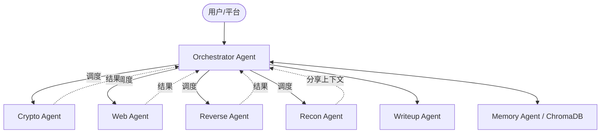

# CTF-ASAS v3.0 设计文档 (Multi-Agent Orchestration)

**创建日期:** 2026-02-10  
**版本:** 3.0  
**状态:** 规划中  
**前置版本:** [v2.0 ReAct](./2026-02-10-v2.0-react-agent-design.md)

---

## 1. 核心目标 (v3.0 Vision)

v3.0 的核心是将单体 ReAct Agent 演进为**多 Agent 协作系统 (Multi-Agent System)**。通过中心化的职能分工，提升在复杂、多阶段 CTF 题目中的成功率，并引入本地模型支持以降低成本。

### 1.1 关键特性

1. **中心化指挥 (Orchestrator)**: 一个大脑负责战略规划与任务分发。
2. **专业化分工**: 针对 Crypto, Web, Reverse 等领域建立独立 Agent。
3. **混合模型策略 (Hybrid LLM)**: 高难度决策使用 Claude 3.5 Sonnet，简单或工具性任务使用本地 LM Studio 模型。
4. **长效记忆 (Historical Memory)**: 基于 RAG 实现解题经验的持续积累。
5. **多题自动调度**: 支持一键扫描平台所有题目并自动任务队列化。

---

## 2. 架构设计

### 2.1 拓扑结构 (Orchestrator Pattern)



### 2.2 Agent 定义与分工

| Agent | 核心职责 | 推荐模型 |
| :--- | :--- | :--- |
| **Orchestrator** | 战略规划、分类、Flag 提交、冲突解决 | Claude 3.5 Sonnet |
| **Recon Agent** | 初始信息收集、端口扫描、Web 路径发现 | 本地模型 (Gemma 3) |
| **Crypto Agent** | 编码分析、数学运算、经典密码破解 | 本地模型 (GPT-OSS) |
| **Web Agent** | 漏洞扫描、Payload 测试、SQLi/RCE 利用 | Claude 3.5 Sonnet |
| **Reverse Agent** | 二进制分析代码逻辑提取、Python Exploit 编写 | Claude 3.5 Sonnet |
| **Writeup Agent** | 跨 Agent 日志汇总、结构化报告生成 | Claude 3.5 Sonnet |
| **Memory Agent** | 知识存取、历史经验检索适配 | 本地模型 (GPT-OSS) |

---

## 3. 技术方案

### 3.1 LLM 抽象层 (Model Factory)

实现一个统一的 `LLMProvider`，通过配置文件动态映射每个 Agent 的后端：

- **Cloud**: 直接对接 LangChain 的 `ChatAnthropic`。
- **Local**: 对接本地 LM Studio (OpenAI 兼容接口)。

### 3.2 节点间通信 (Message Protocol)

Orchestrator 通过 `dispatch_to_agent` 工具启动子 Agent。子 Agent 的返回结构：

```json
{
  "status": "success | failure | indeterminate",
  "flag": "flag{...}",
  "reasoning": "...",
  "artifacts": ["path/to/extracted/data"]
}
```

### 3.3 状态管理

基于 LangGraph 的 `StateGraph`，每个子 Agent 拥有独立分支，Orchestrator 维护全局 `AgentState`，包含题目列表、当前状态、各题执行记录。

---

## 4. 验收标准

- **全流程自动化**: 输入 CTFd URL，系统自动完成从取题到生成 Writeup 的全过程。
- **本地模型接入**: 至少有一个子 Agent 运行在 LM Studio 环境下并成功返回结果。
- **多模型协作**: 支持不少于三个 Agent 在同一题目中按需切换或串联。
