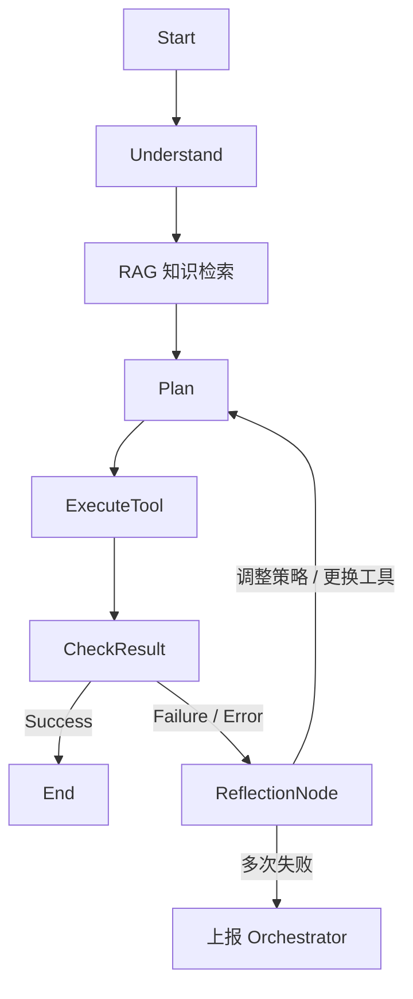

# CTF-ASAS v4.0 设计文档 (Deep Tool Integration & Advanced Reasoning)

**创建日期:** 2026-02-10  
**版本:** 4.0  
**状态:** 规划中  
**前置版本:** [v3.0 Multi-Agent](./2026-02-10-v3.0-multi-agent-ctf-system-design.md)

---

## 1. 核心目标 (v4.0 Vision)

v4.0 旨在将 v3.0 的架构骨架填充为具备**实战级深度利用能力**的系统。不仅引入全套专业工具链（Full Arsenal），还赋予 Agent 自我反思（Self-Correction）与知识检索（RAG）的高级认知能力。

### 1.1 关键特性

1. **Full Arsenal (全武器库)**: 集成 SQLMap, Ghidra, SageMath, Nuclei 等重型工具，不再依赖模拟输出。
2. **Reflection Loop (自我反思)**: 当工具执行失败或 Flag 错误时，自动触发反思节点，调整策略重试。
3. **RAG Knowledge Base (知识增强)**: 基于 ChromaDB 构建 Writeup 知识库，支持语义检索历史解题经验。

---

## 2. 架构升级

### 2.1 思考循环 (Advanced Thinking Loop)

v3.0 的 ReAct 是线性的。v4.0 引入 **Reflection Node**:

### 2.2 工具链矩阵 (Tool Matrix)

| Agent | 新增核心工具 | 容器化需求 |
| :--- | :--- | :--- |
| **WebAgent** | `kali_sqlmap` (深度注入), `kali_browser` (Headless Chrome), `kali_nuclei` | 需要 Kali 完整镜像 |
| **ReverseAgent** | `ghidra_headless` (反编译脚本), `radare2` (静态分析) | 需要 JDK + Ghidra 环境 |
| **CryptoAgent** | `sagemath` (数论计算), `cyberchef_node` (编解码) | 需要 SageMath 容器 |
| **ReconAgent** | `amass` (子域名), `nmap` (全端口) | 现有环境支持 |

---

## 3. 技术方案

### 3.1 知识库 (RAG Engine)

- **存储**: 继续沿用 ChromaDB。
- **内容源**:
    1. 每次成功解题后的 `WriteupAgent` 报告。
    2. (未来) 爬虫抓取的外部 CTF Writeup。
- **检索时机**: 在 `Plan` 阶段前，Agent 会检索 "Show me similar solved tasks regarding [keyword]"。

### 3.2 反思机制 (Self-Correction)

- 在 `AgentState` 中增加 `error_log` 和 `retry_count`。
- 当 `tool_result` 包含 "error" 或 "failed" 关键字时，流程跳转至 `ReflectionNode`。
- `ReflectionNode` Prompt: "你之前的尝试失败了，错误是 {error}。请分析原因，并给出下一步的修正计划（尝试不同参数、不同工具或不同思路）。"

---

## 4. 交付物

- **Docker 化环境**: 提供包含所有重型工具的 `Dockerfile`。
- **RAG 知识库**: 预置部分经典题目的 Writeup 数据。
- **增强版 Agent**: 每个 Agent 都具备 `Reflection` 能力。
