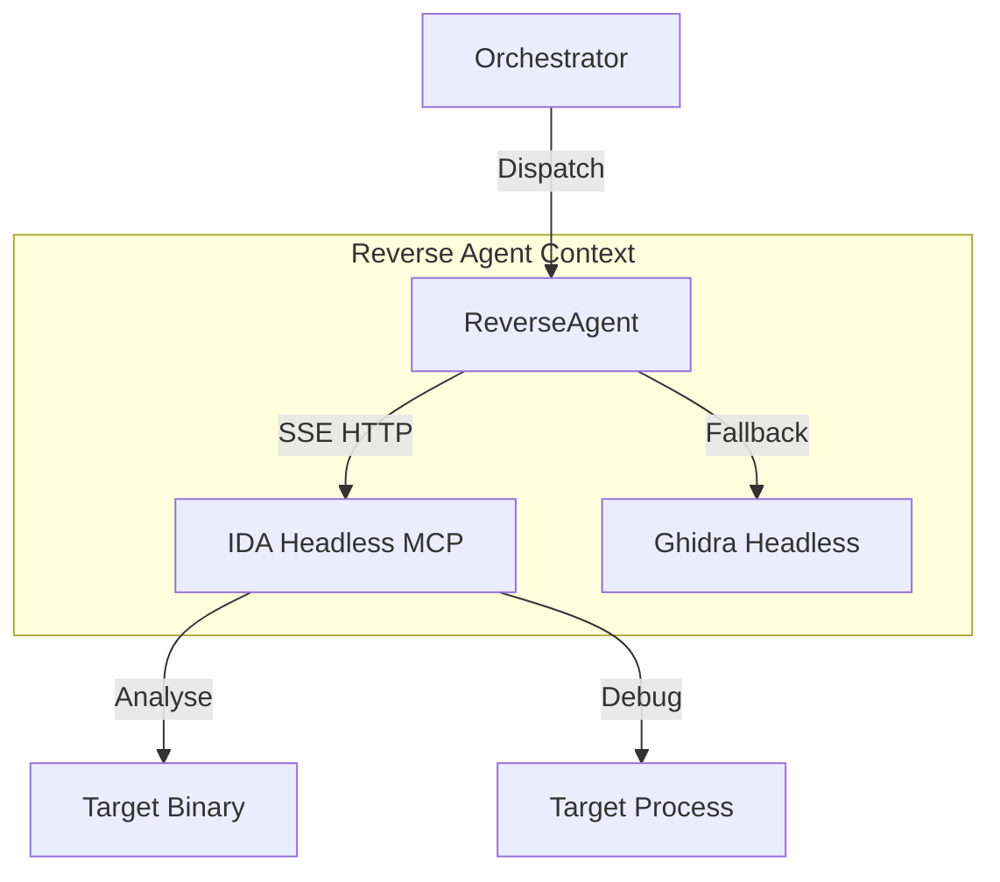

# CTF-ASAS v4.5 设计文档 (IDA Pro Integration)

**创建日期:** 2026-02-10  
**版本:** 4.5  
**状态:** 规划中  
**前置版本:** [v4.0 Deep Tooling](./2026-02-10-v4.0-deep-tooling-and-reasoning-design.md)

---

## 1. 核心目标 (Vision)

v4.5 旨在将 **Run-of-the-mill (普通)** 的逆向能力升级为 **State-of-the-art (顶尖)** 水平。通过集成 **IDA Pro** 及其强大的反编译与调试引擎，ReverseAgent 将具备真正的自动化漏洞挖掘与 Exploit 编写能力。

### 1.1 关键特性

1. **Headless IDA Analysis**: 利用 `idalib` 实现无头全自动分析，无需用户打开 GUI。
2. **Dynamic Debugging**: 支持断点、单步、内存读写，解决静态分析难以处理的混淆与加壳问题。
3. **Python Scripting**: 在 IDA 上下文中执行任意 Python 脚本，自动化提取算法逻辑。

---

## 2. 架构设计

### 2.1 系统架构

### 2.2 核心组件

- **IDA MCP Client**: 一个专门的 Python 客户端，封装了 SSE 协议，负责与 `ida-pro-mcp` 通信。
- **SOP Workflow**: ReverseAgent 的 ReAct 循环被预置了标准作业程序 (Standard Operating Procedure)：
    1. `auto_analyze()`
    2. `search_strings("flag")`
    3. `trace_xrefs()`
    4. `decompile_critical()`
    5. `solve()`

---

## 3. 工具映射 (Tool Mapping)

| 类别 | 工具名称 (MCP) | 用途 |
| :--- | :--- | :--- |
| **基础分析** | `list_funcs`, `list_globals`, `imports` | 获取二进制概览 |
| **静态逆向** | `decompile`, `disasm`, `xrefs_to` | 理解函数逻辑与调用关系 |
| **搜索定位** | `find_regex`, `get_string`, `get_bytes` | 定位关键数据与代码片段 |
| **动态调试** | `dbg_start`, `dbg_step_into`, `dbg_read` | 运行时分析与解密 |
| **自动化** | `py_eval` | 执行复杂计算与逻辑提取 |

---

## 4. 实施计划概览

1. **环境准备**: 部署 `idalib` 与 `ida-pro-mcp` server。
2. **客户端开发**: 实现 `src/asas_mcp/clients/ida_client.py`。
3. **Agent 升级**: 更新 ReverseAgent Prompt 与工具集。
4. **测试验证**: 使用简单 CrackMe 进行端到端测试。
