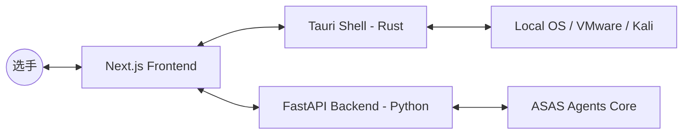

# CTF-ASAS "Command Center" 详细设计方案

## 1. 目标概述

为 CTF-ASAS 构建一个极具视觉冲击力且功能强大的桌面端图形界面（GUI），旨在提升选手的解题效率，增强人机协同体验，并实现解题过程的完全透明化。

## 2. 核心架构：Hybrid Desktop

采用 **Tauri + Next.js + FastAPI** 的混合架构，兼顾桌面端原生能力与现代 Web 技术的开发灵活性。

### 2.1 技术栈选型

- **Desktop Shell**: [Tauri](https://tauri.app/) (基于 Rust)。体积小、性能强、安全性高。
- **Frontend**: Next.js 14 + Tailwind CSS + Framer Motion (精美动效)。
- **Visualization**: [React Flow](https://reactflow.dev/)。用于呈现解题逻辑的动态节点图。
- **Backend API**: FastAPI。将现有的 `agent` 功能包装为 API，并通过 WebSocket 推送实时日志。
- **State Management**: Zustand。

## 3. 功能模块详解

### 3.1 引擎舱 (Engine Pilot - 集成 cc-switch)

- **配置面板**：UI 界面直接配置 OpenAI, DeepSeek, Claude, Gemini 等各大模型的 API Keys 加密存储于本地。
- **动态切换**：支持在解题过程中一键切换“大脑”。例如：Pwn 题目初筛使用 DeepSeek-R1，深层 Payload 生成使用 Claude 3.5 Sonnet。
- **配额监控**：实时监控 Token 消耗与成本。

### 3.2 逻辑流展示区 (The Core Visualization)

- **动态节点图**：
  - `Input Node`: 题目 URL/文件。
  - `Thinking Node`: Agent 的推理路径（如：正在进行 Web 目录扫描）。
  - `Payload Node`: 生成的 Exploit 代码片段，支持点击复制或手动修改。
  - `Console Node`: 原始终端输出流。
- **交互**：点击节点可展开详细内容，双击节点可干预 Agent 的下一步决策。

### 3.3 协作链路 (Human-Agent Uplink)

- **侧边栏聊天窗口**：类似辅助 AI 助手的交互体验。
- **干预机制**：当 Agent 遇到重大决策（如执行危险 Exploit 或请求高价值工具调用）时，在聊天区弹出确认卡片。
- **共创模式**：选手可以在聊天框中直接发送“我觉得偏移量应该是 23”，Agent 接收后自动更新 ROP 链代码并重试。

## 4. 视觉风格 (UI/UX)

- **主题**：赛博朋克深色模式 (Cyberpunk Noir)。
- **色调**：深灰背景 (`#0B0E14`) + 荧光蓝 (`#00F2FF`) + 魅影紫 (`#7000FF`)。
- **效果**：玻璃拟态 (Glassmorphism)、微动效逻辑流连接线。

## 5. 实施方案

1. **阶段一**：初始化 `ui/` 目录，搭建 Next.js 基础骨架。
2. **阶段二**：封装 FastAPI WebSocket 服务，将 Agent 执行过程产生的 `event` 实时推送。
3. **阶段三**：开发 `cc-switch` 风格的模型管理中心。
4. **阶段四**：实现 React Flow 逻辑展示组件。
5. **阶段五**：集成 Tauri 桌面应用外壳。
